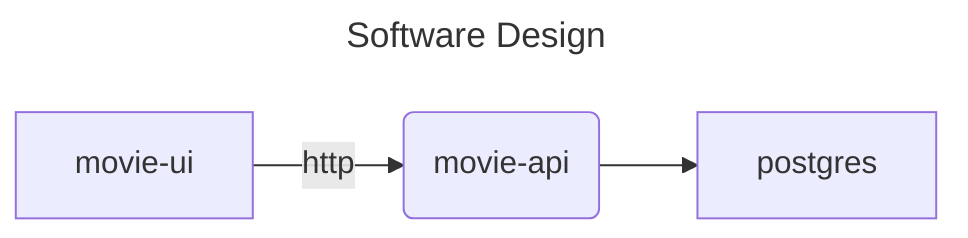
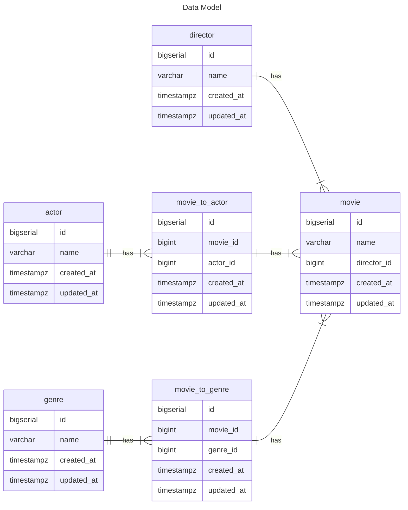

# movie-platform

## Setup
```
ROOT_FOLDER=`pwd`

cd ${ROOT_FOLDER}/movie-ui
docker build .
docker run movie-ui

cd ${ROOT_FOLDER}/movie-api
docker build .
docker run movie-api

cd ${ROOT_FOLDER}/postgres
docker build .
docker run postgre

```


## Technical Details



