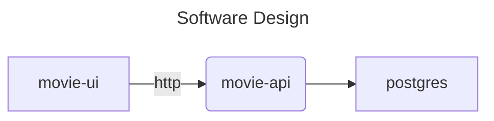
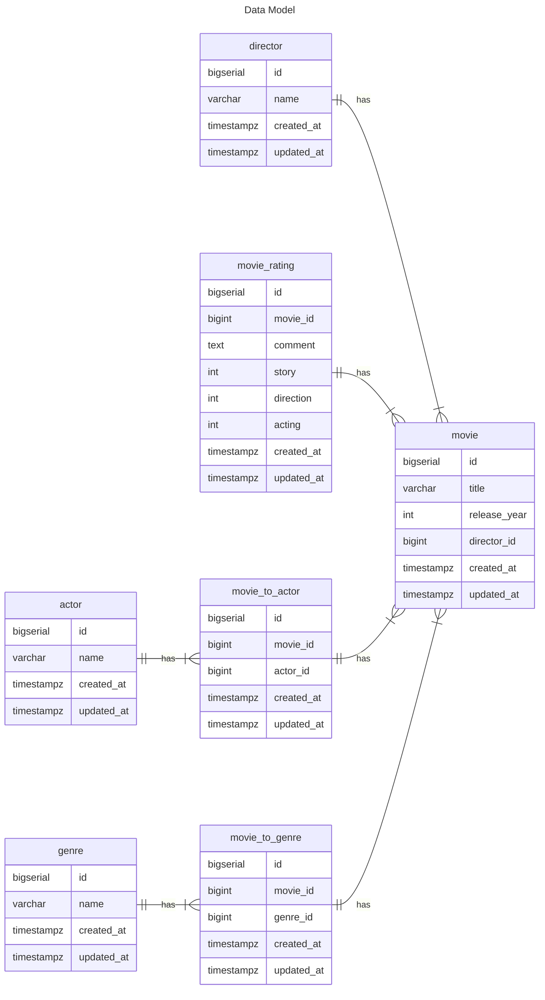

# movie-platform

## Setup
```
ROOT_FOLDER=`pwd`
MOVIE_POSTGRES_PASSWORD=[MY_PASSWORD]

cd ${ROOT_FOLDER}/postgres
docker build --build-arg MOVIE_POSTGRES_PASSWORD=${MOVIE_POSTGRES_PASSWORD} -t movie-postgres .
docker run -it -d movie-postgres --name movie-postgres
docker exec -it movie-postgres "psql -U movie -W -d movie -a -f ${ROOT_FOLDER}/movie-api/src/db/migrations/2026-01-03"

echo "sed command may work. Please try editing movie-api/.env file without sed" && cd ${ROOT_FOLDER}/movie-api && sed -e "/s/POSTGRES_PASSWORD=\"\"/POSTGRES_PASSWORD=\"${MOVIE_POSTGRES_PASSWORD}\"/g" -i .env

echo "POSTGRES_HOST is set as localhost in movie-api/.env. Please update to docker postgres container uri. >> docker exec -it [postgres docker container] /bin/sh >> cat /etc/hosts [You will find line with ip of postgres docker like 172.17.0.1	06d93546a9a1]" && cd ${ROOT_FOLDER}/movie-api && sed -e "/s/POSTGRES_HOST=\"localhost\"/POSTGRES_HOST=\"172.17.0.1\"/g" -i .env

cd ${ROOT_FOLDER}/movie-api
docker build -t movie-api .
docker run -it -d -p 8000:8000 -p 5432:5432 movie-api

cd ${ROOT_FOLDER}/movie-ui
docker build -t movie-ui .
docker run -it -d -p 3000:3000 movie-ui
```


## Technical Details




